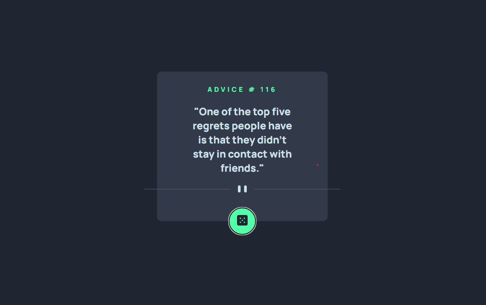
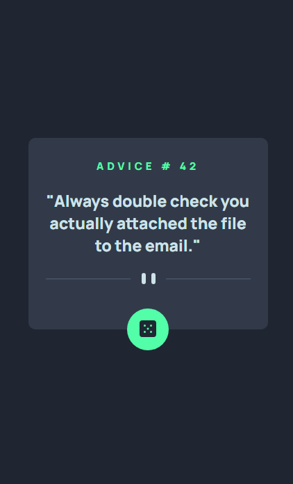

# App Gerador De Conselhos

## Descrição

Um app gerador de conselhos aleatórios! 🚀

## Conceitos trabalhados e fixados no projeto:

* Estrutura de pastas padrão no projeto; ✅
* HTML Semântico; ✅
* Display Flex; ✅
* Responsividade; ✅
* Conceitos de código assíncrono no JS (funções assíncronas e await); ✅
* Uso de funções; DOM; eventos e método fetch(url) no JS; ✅
* Uso de uma API gratuita de conselhos ✅

## Design Desktop

<div align="center">
    ](https://google.com)
</div>

## Design Mobile

<div align="center">
    ](https://google.com)
</div>

## Como Utilizar

1 - Clone o projeto
```
git clone <url>
```

2 - Acesse a pasta do projeto

```
cd app-gerador-de-conselhos
```